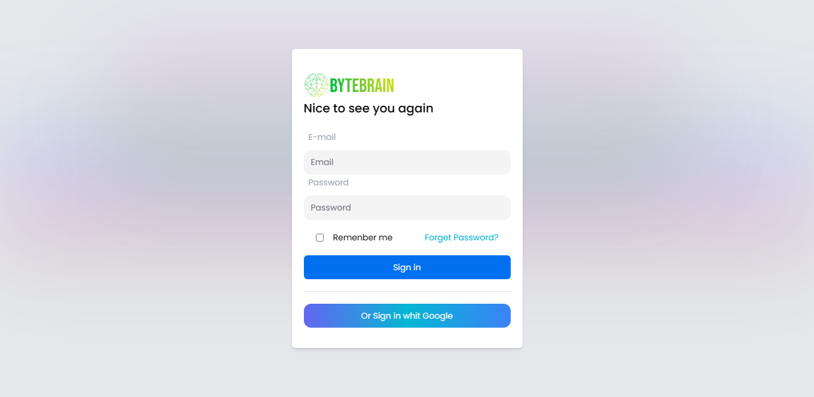
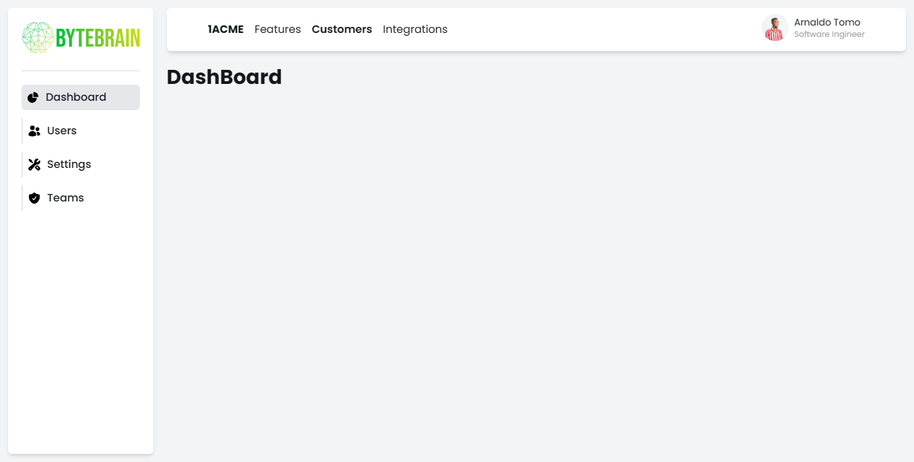

# Dashboard Completo com Tailwind CSS e Next.js

Este projeto é um dashboard completo desenvolvido usando Tailwind CSS e Next.js, proporcionando uma experiência de desenvolvimento moderna e uma interface de usuário elegante. Ele é projetado para ser altamente customizável e fácil de entender, proporcionando uma base sólida para a criação de painéis de controle web dinâmicos e responsivos.

## Recursos Principais

- **Tailwind CSS:** A estrutura de estilo utilitário do Tailwind CSS oferece um desenvolvimento rápido e consistente, permitindo personalização fácil e escalabilidade do projeto.

- **Next.js:** Aproveite os benefícios do Next.js para construir aplicativos React altamente otimizados, com funcionalidades como renderização no lado do servidor, geração de páginas estáticas e roteamento eficiente.

- **Componentização:** O projeto é estruturado com uma abordagem baseada em componentes, tornando-o modular e fácil de manter. Os componentes podem ser reutilizados em diferentes partes do dashboard.

- **Integração com Google Fonts:** Estilize seu dashboard com facilidade usando a fonte Poppins do Google Fonts para uma aparência moderna e legível.
## Capturas de Tela 📸

